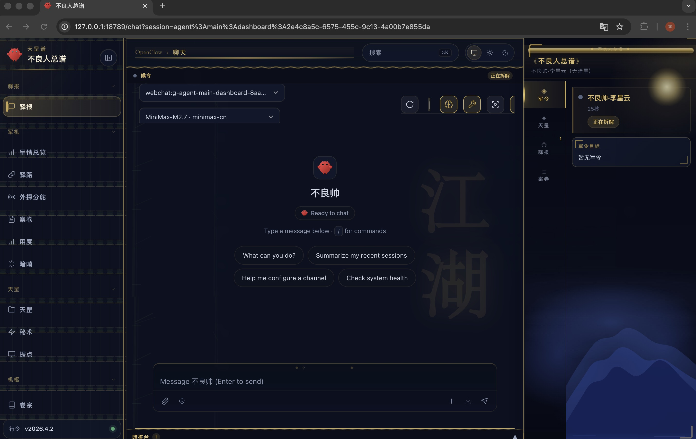
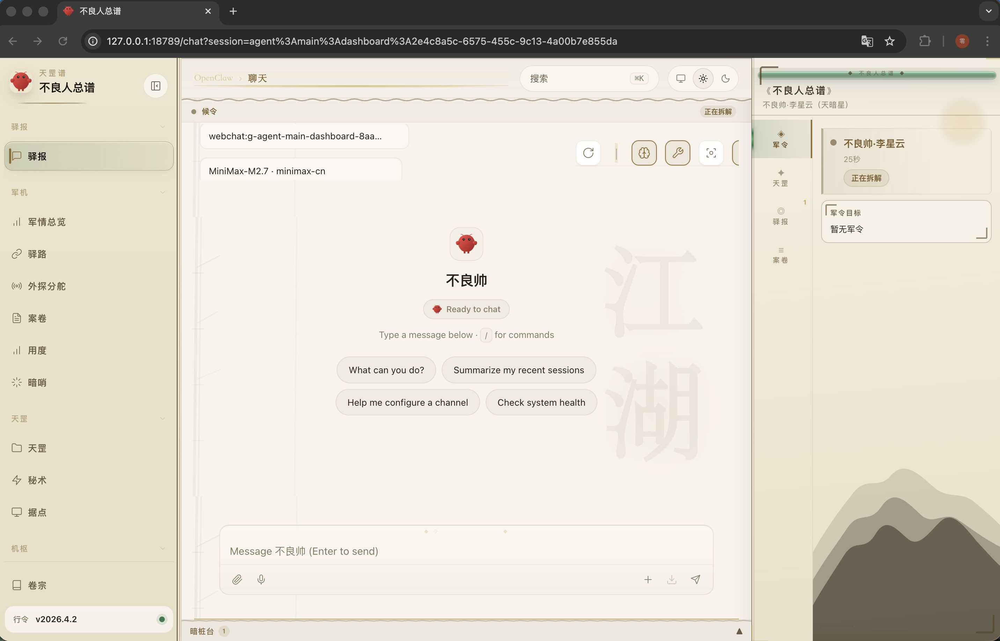
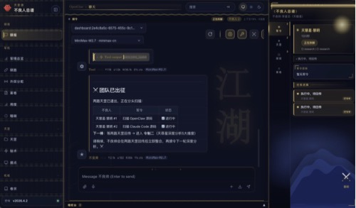
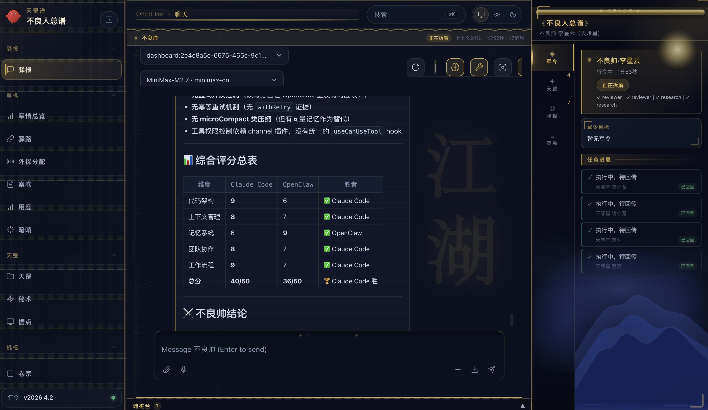

# OpenClaw Team Memory Context

一个可公开分发的 OpenClaw 完整整理版，重点增强上下文治理、结构化记忆和多智能体团队协作。

它包含两层内容：

- 根目录：可直接安装和运行的 OpenClaw 主体包，保留上游 CLI 入口、dist、docs、assets 和 bundled skills。
- [workspace](workspace)：你的核心增强层，重点是上下文治理、结构化记忆、团队编排和可执行技能系统。

这个版本已经移除了任务、会话、日志、密钥、认证档案和其他私人运行态数据，适合直接作为公开仓库持续维护。

## 项目定位

这不是只展示几个核心文件的代码样例仓库，而是一个可以实际安装、初始化和运行的 OpenClaw 公开版。目标是让别人既能直接把项目跑起来，也能看见这套增强层真正解决了什么问题。

保留的公开能力：

- OpenClaw 可运行包本体
- 自定义 workspace 增强层
- 结构化记忆与团队工作流代码
- 脱敏模板配置与本地初始化脚本

排除的私人内容：

- 会话记录、任务记录、日志、交付历史
- API keys、auth profiles、设备绑定信息
- 每日记忆、恢复快照、运行期 active 状态
- 任何直接暴露你真实工作内容的痕迹

## 亮点

- 显式的上下文预算、压缩触发和会话交接机制
- 结构化记忆提取、路由、去重、验证和 TTL 分层
- 团队派工、任务状态持久化和多角色协作编排
- 可执行 skill 模板、工具 hook 和重试基础设施

## 快速开始

要求：Node 22.12+，推荐 Node 24。

```bash
git clone git@github.com:cling0809/openclaw-team-memory-context.git
cd openclaw-team-memory-context
pnpm install

pnpm public:setup
pnpm public:onboard
pnpm public:gateway
```

说明：

- `public:setup` 会在仓库根目录下创建 `.openclaw-public/` 本地状态目录，并生成脱敏后的 `openclaw.json`。
- `public:onboard` 会自动带上本地状态目录、模板配置和本仓库的 `workspace/` 路径。
- `public:gateway` 会用同一套本地配置启动 Gateway。

是否可以直接用：

- 可以，但前提是先安装依赖。
- 仓库已经包含可直接运行的 OpenClaw CLI 入口和预编译 `dist/`，不需要你先自己构建 TypeScript 输出。
- clone 下来后，按上面的步骤执行 `pnpm install`、`pnpm public:setup`，再进入 `pnpm public:onboard` 或 `pnpm public:gateway` 即可开始使用。
- 本仓库默认把本地运行态写入 `.openclaw-public/`，不会污染版本库。

如果你只想直接体验 agent：

```bash
pnpm public:agent -- --message "hello"
```

## Showcase

### 暗色主题主界面



### 浅色主题主界面



### 团队派工与任务进展



### 分析报告视图



## 仓库结构

- [package.json](package.json): OpenClaw 包定义和公开版快捷脚本
- [openclaw.mjs](openclaw.mjs): CLI 启动入口
- [dist](dist): 预编译运行时代码
- [docs](docs): 上游文档
- [skills](skills): bundled skills
- [workspace](workspace): 自定义增强层与公开版 workspace
- [templates/openclaw.public.template.json](templates/openclaw.public.template.json): 脱敏配置模板
- [scripts/setup-public-home.mjs](scripts/setup-public-home.mjs): 初始化本地状态目录
- [scripts/run-public.mjs](scripts/run-public.mjs): 公开版命令包装器
- [UPSTREAM_COMPARISON.md](UPSTREAM_COMPARISON.md): 上游对比和改进总结
- [PUBLISHING.md](PUBLISHING.md): 发布到 GitHub 前的检查项

## 核心模块

核心增强在 [workspace](workspace) 下，重点包括：

- [workspace/contextTracker.js](workspace/contextTracker.js): 上下文预算和压缩触发
- [workspace/extractMemories.js](workspace/extractMemories.js): 结构化记忆提取与路由
- [workspace/memory](workspace/memory): 记忆模型、TTL 和 schema
- [workspace/src](workspace/src): store、task persistence、tool partition、skill engine 等基础设施
- [workspace/scripts](workspace/scripts): 编排状态存储与辅助运行时
- [workspace/team-orchestration](workspace/team-orchestration): 团队对象 schema 与状态持久化
- [workspace/skills](workspace/skills): 自定义 workflow skills

## 为什么这个仓库值得看

相对上游，最核心的价值不是“多了某一个点状功能”，而是把原本分散的能力推进成了更工程化的一层：

1. 上下文管理从经验式处理变成了显式预算和压缩治理。
2. 记忆从 Markdown 沉淀变成了结构化路由、去重、验证和 TTL 管理。
3. 多 agent 从简单分发变成了可恢复的团队编排状态机。
4. Skill 从静态文档变成了可执行模板与可观测基础设施。

更详细的表述见 [UPSTREAM_COMPARISON.md](UPSTREAM_COMPARISON.md)。

## 开源边界

这个仓库刻意没有包含任何私人运行态数据。日常使用时，新产生的本地状态会写入 `.openclaw-public/`，并且已经被 [.gitignore](.gitignore) 排除。

如果你继续在这个仓库上开发，建议把所有个人状态都留在 `.openclaw-public/` 下，不要写回仓库追踪文件。