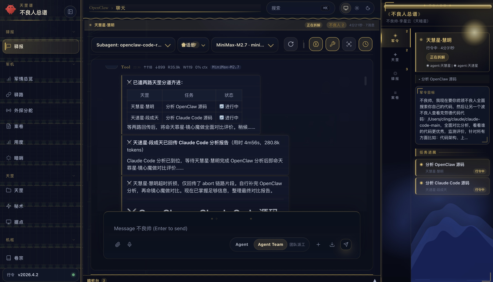
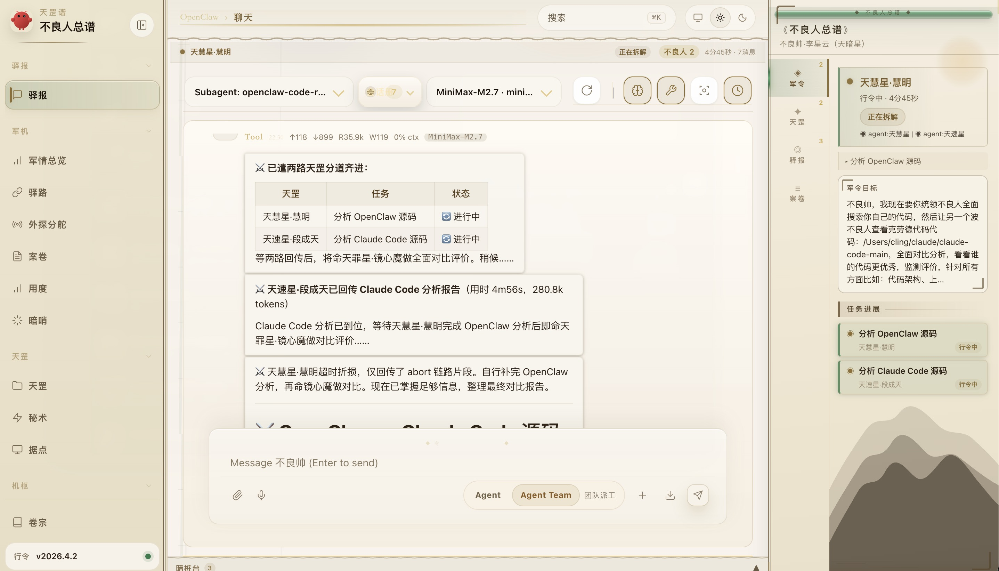
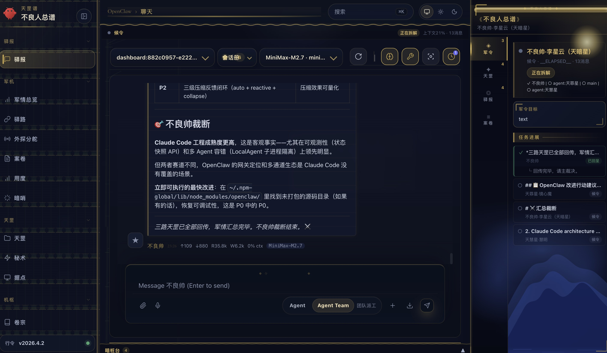

# OpenClaw Team Memory Context · 不良人公开版

一个可公开分发、可直接运行的 OpenClaw 不良人公开版，围绕上下文治理、结构化记忆、多智能体派工和不良人总谱控制台做了完整整理。

当前公开发行线：`2026.4.2`

- 对齐你当前正在使用的不良人增强版 UI、总谱状态机和团队派工体验
- 公开仓只保留可安全公开的能力、模板和工作流，不包含任何私人运行态数据

它包含两层内容：

- 根目录：可直接安装和运行的 OpenClaw 主体包，保留上游 CLI 入口、dist、docs、assets 和 bundled skills。
- [workspace](workspace)：你的核心增强层，重点是上下文治理、结构化记忆、团队编排和可执行技能系统。

这个版本已经移除了任务、会话、日志、密钥、认证档案和其他私人运行态数据，适合直接作为公开仓库持续维护。

## 项目定位

这不是只展示几个核心文件的代码样例仓库，而是一个可以实际安装、初始化和运行的 OpenClaw 公开版。目标是让别人既能直接把项目跑起来，也能看见这套增强层真正解决了什么问题。

保留的公开能力：

- OpenClaw 可运行包本体
- 自定义 workspace 增强层
- 结构化记忆与团队工作流代码
- 脱敏模板配置与本地初始化脚本

排除的私人内容：

- 会话记录、任务记录、日志、交付历史
- API keys、auth profiles、设备绑定信息
- 每日记忆、恢复快照、运行期 active 状态
- 任何直接暴露你真实工作内容的痕迹

## 亮点

- 显式的上下文预算、压缩触发和会话交接机制
- 结构化记忆提取、路由、去重、验证和 TTL 分层
- 团队派工、任务状态持久化和多角色协作编排
- 可执行 skill 模板、工具 hook 和重试基础设施
- 不良人总谱风格的 Control UI 扩展和智能体身份体系
- 更接近作者本地日常使用体验的安全公开配置包

## 快速开始

要求：Node 22.12+，推荐 Node 24。

重要：

- 以下命令都要在仓库根目录执行。
- 要使用这套“不良人公开版”，必须走 `pnpm public:*` 这组包装命令。
- 不要直接运行原生 `openclaw onboard`、`openclaw gateway`、`openclaw dashboard`。
- 如果直接用原生 `openclaw` 命令，运行时通常会回到你机器上默认的 `~/.openclaw` 配置，子 agent 也会退化成通用 `A / B / C` 或普通 role agent，而不是这套天罡席位。

```bash
git clone git@github.com:cling0809/openclaw-team-memory-context.git
cd openclaw-team-memory-context
pnpm install

# 只用公开版包装命令，不要直接用原生 openclaw 命令
pnpm public:setup
pnpm public:onboard
pnpm public:gateway
# 新开一个终端查看 dashboard 地址（等价入口：pnpm oc-web）
pnpm public:dashboard
```

说明：

- `public:setup` 会在仓库根目录下创建 `.openclaw-public/` 本地状态目录，并生成脱敏后的 `openclaw.json`。
- `public:setup` 还会生成每个 agent 的角色工作区骨架，保留不良人人设、协作规则和共享 workspace 快照。
- `public:setup` 现在还会预建 `.openclaw-public/agents/<id>/{agent,sessions}`，并在检测到 `MINIMAX_API_KEY` 时自动把主 agent 的 MiniMax 认证写入并镜像到所有角色 agent；如果你本机已经有 `~/.openclaw/agents/*/agent/auth-profiles.json`，也会优先导入现成认证，避免派工时各自找不到 auth store。
- `public:onboard` 会自动带上本地状态目录、模板配置和本仓库的 `workspace/` 路径。
- `public:gateway` 会用同一套本地配置启动 Gateway。
- `public:dashboard` 会打印当前公开版实例的 dashboard URL，并自动在浏览器打开。
- 这 4 步执行完后，运行时会明确落在仓库内的 `.openclaw-public/`，而不是你机器上原本的 `~/.openclaw/`。
- 只有这样启动，公开版里的天罡身份、右侧总谱、团队派工和角色工作区骨架才会真正生效。
- `oc-web` 是 `public:dashboard` 的公开版别名；在仓库里可直接用 `pnpm oc-web`，全局安装后可直接执行 `oc-web`。
- `public:token` 会打印当前公开版实例使用的 gateway token，便于首次连接 Control UI。
- `public:devices:list` 和 `public:devices:approve` 用来处理复用旧浏览器状态时残留的配对请求。
- `public:refresh` 会用最新公开模板重写本地 `.openclaw-public/openclaw.json` 和角色工作区骨架，适合拉到新版本后刷新体验。

错误示例：

```bash
openclaw onboard
openclaw gateway
openclaw dashboard
```

上面这样跑，通常不会进入这份公开版生成的 `.openclaw-public/`，而是回到你机器自己的默认运行态；这也是别人 clone 后仍然看到通用子代理、看不到完整天罡席位的最常见原因。

是否可以直接用：

- 可以，但前提是先安装依赖。
- 仓库已经包含可直接运行的 OpenClaw CLI 入口和预编译 `dist/`，不需要你先自己构建 TypeScript 输出。
- clone 下来后，按上面的步骤执行 `pnpm install`、`pnpm public:setup`，再进入 `pnpm public:onboard` 或 `pnpm public:gateway` 即可开始使用。
- 如果你已经有 MiniMax key，最快路径是先在当前 shell 里设置 `MINIMAX_API_KEY`，再执行 `pnpm public:setup` 或 `pnpm public:refresh`；公开版脚本会把它写进 main agent 的 auth store，并同步到所有角色 agent。
- 如果你机器上原本就有可用的 `~/.openclaw` 运行态，公开版脚本也会自动把现成的 `auth-profiles.json` 导入到 `.openclaw-public/agents/*/agent/`，这样主 agent 和角色 agent 不需要重新逐个配对。
- 即使当前 shell 没有导出 `MINIMAX_API_KEY`，只要 main agent 已经有 `auth-profiles.json`，`public:gateway` 也能正常启动；它不会再被模板里的占位 env 直接拦住。
- 公开版初始化会自动补齐 `gateway.mode=local` 和本地 token 认证，避免不同机器上出现未配置网关或首次连接无法鉴权的问题。
- 公开模板默认启用了 `gateway.controlUi.allowInsecureAuth=true`，尽量避免首次通过本地 HTTP 打开 Control UI 时被设备配对拦住写操作或子 agent 派工。
- 公开模板已经对齐到当前 OpenClaw 的 MiniMax provider ID（`minimax`），不会再出现新版本 onboard 已经写入 MiniMax 凭据，但公开模板仍然去找过期 `minimax-cn` provider 的错位。
- 公开版还会同步安全可公开的模型别名、技能启用、工具配置、浏览器能力和不良人多工作区骨架，让整体体验更接近作者本地日常使用的版本。
- 本仓库默认把本地运行态写入 `.openclaw-public/`，不会污染版本库。

如果你只想把 MiniMax 认证先配好，再启动公开版，推荐这样做：

```bash
export MINIMAX_API_KEY=你的_key
pnpm public:setup
pnpm public:gateway
```

如果你是旧版本用户，想把本地体验升级到当前这版，而不是只补缺失字段，执行：

```bash
pnpm public:refresh
```

如果你只想直接体验 agent：

```bash
pnpm public:agent -- --message "hello"
```

## 不良人 UI 与身份

公开版现在已经包含你本地那套不良人主题控制台扩展，加载入口在 [dist/control-ui/index.html](dist/control-ui/index.html)，核心文件包括：

- [dist/control-ui/assets/teamTaskStore.js](dist/control-ui/assets/teamTaskStore.js): 不良人总谱状态仓、席位映射和 companion sprite 状态
- [dist/control-ui/assets/buli-team-panel.js](dist/control-ui/assets/buli-team-panel.js): 右侧不良人总谱面板、天罡 roster、驿报和案卷视图
- [dist/control-ui/assets/panel-layout-overrides.css](dist/control-ui/assets/panel-layout-overrides.css): 古风三栏布局、状态条和暗桩台视觉覆盖

公开模板里的智能体身份也已经切换为不良人设定，详细列表见 [AGENT_IDENTITIES.md](AGENT_IDENTITIES.md)。

除了 UI 和名字，公开版现在还会生成一套不含私人数据的角色工作区骨架，尽量贴近作者本地的真实使用方式：

- 每个 agent 都有自己的 `AGENTS.md`、`IDENTITY.md`、`SOUL.md`、`USER.md`、`MEMORY.md`
- 每个角色工作区都会带一份共享 `workspace/` 快照，便于保留相同的 skill 和增强层上下文
- 保留了安全可公开的工具、技能、模型别名和浏览器能力配置

如果你之前已经生成过本地 `.openclaw-public/openclaw.json`，想把 agent 身份一起刷新到新版模板，可执行：

```bash
pnpm public:refresh
```

## 常见问题

### `gateway token mismatch` / `device token mismatch`

这类报错通常不是 Gateway 没起来，而是浏览器里的 Control UI 还保留着旧 token 或旧设备令牌。

推荐按这个顺序处理：

```bash
pnpm public:gateway
pnpm public:dashboard
pnpm public:token
pnpm public:devices:list
pnpm public:devices:approve
```

- 打开 `public:dashboard` 打印出来的 URL。
- 如果 Control UI 要求认证，把 `public:token` 打印出的 token 粘贴到设置里。
- 如果 Control UI 还能连上但执行派工、发送或写操作时报 `pairing required`，先运行 `pnpm public:devices:list` 看是否有待审批请求，再执行 `pnpm public:devices:approve`。
- 如果连 `public:devices:list` 都报 `gateway token mismatch`，说明你本机还有旧 gateway 在跑，先执行 `pnpm public:gateway:stop`，再重新执行 `pnpm public:gateway`。
- 如果仍然出现 `device token mismatch`，清掉 `127.0.0.1:18789` 或 `localhost:18789` 的站点数据后重开，或者直接用无痕窗口再试一次。
- 如果是旧版本仓库首次生成的 `.openclaw-public/openclaw.json`，现在的包装脚本会在下一次运行时自动补齐缺失的 `gateway.mode` 和 `gateway.auth.token`，不需要手工重建整个仓库。

### `No API key found for provider "minimax"`

这通常不是 OpenClaw 本体坏了，而是当前公开版实例还没有拿到你自己的 MiniMax 凭据，或者你本地还保留着旧版 `minimax-cn` 模板生成的配置。

推荐按这个顺序处理：

```bash
export MINIMAX_API_KEY=你的_key
pnpm public:refresh
pnpm public:gateway
```

- `public:refresh` 现在会同时迁移旧版公开模板和已导入 `auth-profiles.json` 里的 `minimax-cn` 引用，统一切到当前版本真实使用的 `minimax` provider。
- `public:refresh` 也会顺手清掉旧模板遗留的 `${MINIMAX_API_KEY}` 占位配置，避免 Gateway 在 auth store 已经存在时仍然因为缺少环境变量而拒绝启动。
- 如果 main agent 已经有 auth store，包装脚本会在下一次运行时自动把同一份 auth-profiles 同步到 coder、research、qa 等角色 agent，避免子 agent 派工时报各自缺 key。
- 如果你更想走交互式配置，也可以重新运行 `pnpm public:onboard`；当前 OpenClaw 版本会使用新的 MiniMax provider 选项写入正确的 auth store。

### `oc-web` 打不开 / 显示无法访问

公开版现在提供两种等价入口：

```bash
pnpm oc-web
pnpm public:dashboard
```

- 如果你在作者私有环境里习惯直接输入 `oc-web`，公开仓库里对应的是上面的别名入口；全局安装本包后也可以直接运行 `oc-web`。
- 如果浏览器打开后仍然无法访问，先确认 `pnpm public:gateway` 正常启动；当前公开模板已经不会再因为缺失 `MINIMAX_API_KEY` 环境变量而把 Gateway 启动直接拦死。

## Showcase

### 暗色主题 · 天罡并进总谱



### 浅色主题 · 纸卷工作台



### 暗色主题 · 裁断与军情回呈



## 仓库结构

- [package.json](package.json): OpenClaw 包定义和公开版快捷脚本
- [openclaw.mjs](openclaw.mjs): CLI 启动入口
- [dist](dist): 预编译运行时代码
- [dist/control-ui/index.html](dist/control-ui/index.html): Control UI 入口，现已自动加载不良人面板扩展
- [docs](docs): 上游文档
- [skills](skills): bundled skills
- [workspace](workspace): 自定义增强层与公开版 workspace
- [templates/openclaw.public.template.json](templates/openclaw.public.template.json): 脱敏配置模板
- [scripts/setup-public-home.mjs](scripts/setup-public-home.mjs): 初始化本地状态目录
- [scripts/run-public.mjs](scripts/run-public.mjs): 公开版命令包装器
- [AGENT_IDENTITIES.md](AGENT_IDENTITIES.md): 默认公开版智能体身份与角色说明
- [UPSTREAM_COMPARISON.md](UPSTREAM_COMPARISON.md): 上游对比和改进总结
- [PUBLISHING.md](PUBLISHING.md): 发布到 GitHub 前的检查项

## 核心模块

核心增强在 [workspace](workspace) 下，重点包括：

- [workspace/contextTracker.js](workspace/contextTracker.js): 上下文预算和压缩触发
- [workspace/extractMemories.js](workspace/extractMemories.js): 结构化记忆提取与路由
- [workspace/memory](workspace/memory): 记忆模型、TTL 和 schema
- [workspace/src](workspace/src): store、task persistence、tool partition、skill engine 等基础设施
- [workspace/scripts](workspace/scripts): 编排状态存储与辅助运行时
- [workspace/team-orchestration](workspace/team-orchestration): 团队对象 schema 与状态持久化
- [workspace/skills](workspace/skills): 自定义 workflow skills

## 为什么这个仓库值得看

相对上游，最核心的价值不是“多了某一个点状功能”，而是把原本分散的能力推进成了更工程化的一层：

1. 上下文管理从经验式处理变成了显式预算和压缩治理。
2. 记忆从 Markdown 沉淀变成了结构化路由、去重、验证和 TTL 管理。
3. 多 agent 从简单分发变成了可恢复的团队编排状态机。
4. Skill 从静态文档变成了可执行模板与可观测基础设施。

更详细的表述见 [UPSTREAM_COMPARISON.md](UPSTREAM_COMPARISON.md)。

## 开源边界

这个仓库刻意没有包含任何私人运行态数据。日常使用时，新产生的本地状态会写入 `.openclaw-public/`，并且已经被 [.gitignore](.gitignore) 排除。

为了尽量保留作者的使用体验，公开版已经同步了 UI、人设、多工作区骨架和安全可公开的运行配置；但以下内容仍然不会包含在仓库或模板里：

- 真实对话记录和 session 日志
- 真实 API key、OAuth token、设备令牌
- 飞书等外部渠道的私有凭据
- 私人研究资料、个人任务、历史工作目录

如果你继续在这个仓库上开发，建议把所有个人状态都留在 `.openclaw-public/` 下，不要写回仓库追踪文件。
